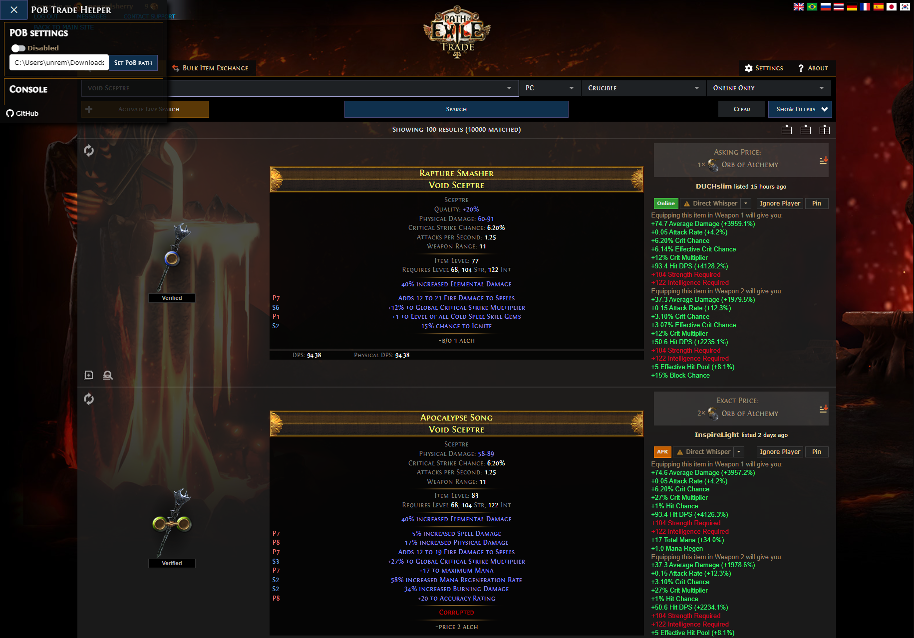
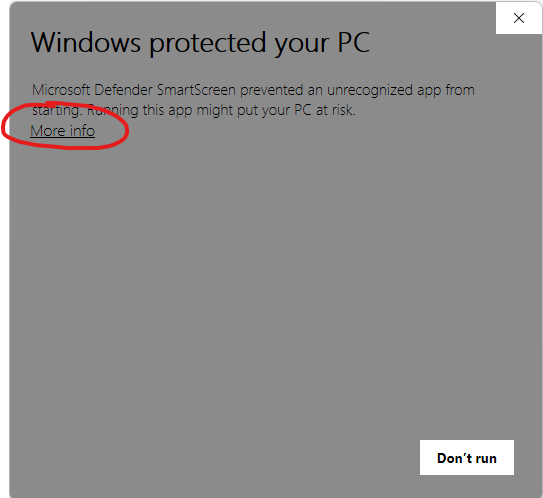
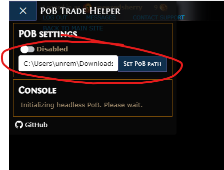

# Path of Building Trade Helper

A chrome extension + local host combo that connects to your local [Path of Building](https://pathofbuilding.community/) scripts and shows you the impact of trade on your current active build.  

## Features
-   Open [Path of Exile trading](https://www.pathofexile.com/trade) in a new tab.
-   Automatically / manually calculate the impact of specific items in [Path of Exile trading](https://www.pathofexile.com/trade) on your current active PoB build.

## How to use

### Install local host app
For the extension to work properly, we'll have to set up some host app so that it can communicate with PoB scripts. There're 2 ways of doing this right now:
1.  __Install through the NSIS installer__
The necessary components of the client host has been packed and published into [PobTradeHelper.exe](https://github.com/unremem/PoBTradeHelper/releases/download/host/PobTradeHelper.exe) through the [NSIS script](https://github.com/unremem/PoBTradeHelper/blob/host/client/PobTradeHelper.nsi). The installer would extract the files, add proper Chrome native messaging entry to the registry, and hook up the uninstaller.
You can uninstall the app any time through __Add or remove programs__ in your Windows menu when you don't want this feature any more.
You might need to bypass the Windows SmartScreen to install the package, and the exe is not recognized by Microsoft.

2.  __Install through batch scripts__
If you don't trust the installer generated, you can also just 
- [Clone / download this repo](https://github.com/unremem/PoBTradeHelper/archive/refs/heads/main.zip).
- Run `client\install.bat`from command line to set up the registry.
- Don't forget to run `client\uninstall.bat` once you are done with this app.

### Install Chrome extension
Similar to the host app, there're 2 ways of installing the Chrome extension:
1.  __Install through Chrome Web Store__
Simply download the [PoB Trade Helper](https://chrome.google.com/webstore/detail/pob-trade-helper/jfmagnicmcjddboobcfaicohajkdmcpc?hl=en&authuser=0) extension, and manage through `chrome://extensions/`.
2.  __Manually install the extension__
If you want to customize the extension, you can also just
- [Clone / download this repo](https://github.com/unremem/PoBTradeHelper/archive/refs/heads/main.zip).
- Go to _chrome://extensions/_ and enable developer mode.
- Click on __Load unpacked__ and select the cloned folder.

### Set up PoB path in the extension
Once the extension is enabled, in PoE trade site, you should see a new icon on top left corner of the page, next to your user profiles. Click on the icon to open up the settings of this extension, where you can specify the local PoB directory. Just copy the path from FileExplorer and hit __Set PoB Path__ and we are good to go!

### I want to update / switch my build
All build related changes should be done in your own PoB binary. Once you apply changes to them in PoB, just hit __Save__ and it should also be reflected in the extension. (Refresh of the page might be needed)

## How this works
The client host leverages the work in [pob_wrapper](https://github.com/coldino/pob_wrapper)(HUGE thanks to @coldino), to instantiate a headless PoB process through Python, and establish the communication channel between the PoB process and extension background process.
The extension then monitors the [Path of Exile trading](https://www.pathofexile.com/trade) page and send the items along with their specs and ids to the PoB process, and renders the impact information according to the response.

## TODOs
- Extend the support to beyond Windows + Chrome
- Reduce / remove the dependency on Python and [pob_wrapper](https://github.com/coldino/pob_wrapper)
- Potentially fork PoB to support hosting messages natively

## Licence

[MIT](https://opensource.org/licenses/MIT)

For 3rd-party licences, see  [LICENSE](https://github.com/unremem/PoBTradeHelper/blob/main/LICENSE). The licencing information is considered to be part of the documentation.